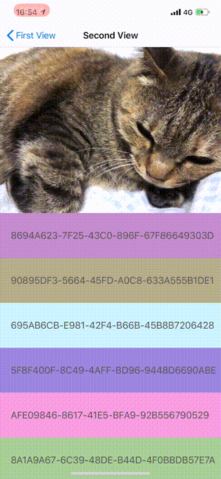

# PinterestLikePullToPop

Pinterest like pull down to pop gesture with animation.

## TL;DR
* Pull down to pop a view controller from `UINavigationController` stack.
* Working with `UIScrollView` behavior, and its subclass of `UITableView`, `UICollectionView`.
* Using `UIViewControllerAnimatedTransitioning`.
* Not using `UIPercentDrivenInteractiveTransition`.

## Environment
* Xdode 10.1
* Swift 4.2

Contribution is welcome: I'd like to improve this gesture more natural and modulable.
